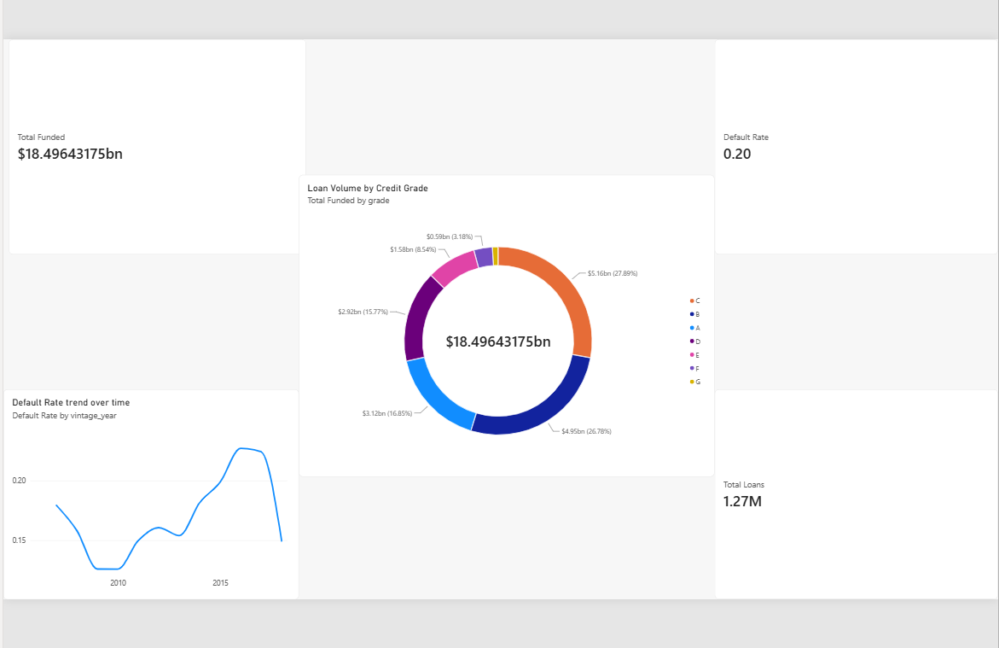
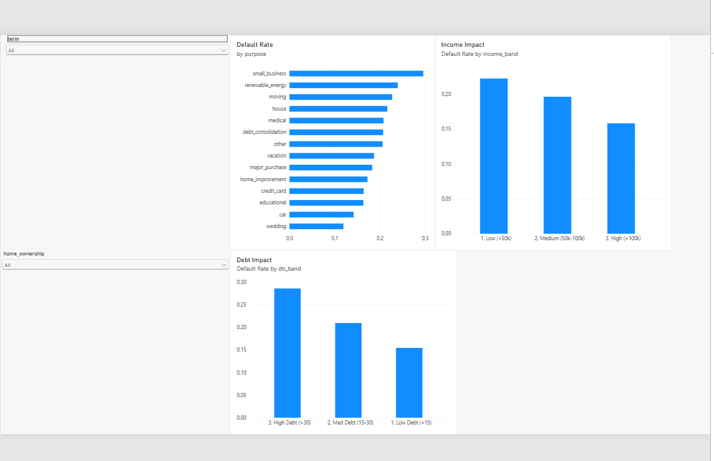

# Consumer Loan Risk & Portfolio Analysis

An end-to-end data analytics project evaluating lending portfolio health, cohort performance, and default risks. This project processes over 1.2 million loan records to provide actionable insights for risk mitigation and strategic underwriting.

## Project Overview & Tech Stack

This project mirrors a professional data workflow, moving from raw data extraction to interactive visualization. 

* **Python (Jupyter Notebook):** Data cleaning, exploratory data analysis (EDA), and cohort feature engineering using Pandas and NumPy.
* **MySQL:** Advanced risk ranking, portfolio aggregations, and window functions to query the 1.2M+ row dataset efficiently.
* **Power BI:** Interactive executive dashboards featuring DAX measures and slicers for real-time risk diagnostics.

## Key Business Questions Addressed

* **Portfolio Health:** What is the overall default rate and how does it trend across different loan vintage years?
* **Risk by Purpose:** Which loan purposes (e.g., medical, debt consolidation, small business) carry the highest risk of default?
* **Financial Diagnostics:** How do term lengths (36 vs. 60 months) and debt-to-income (DTI) bands impact a borrower's likelihood to default?

## Dashboard Previews

### Executive Summary

### Risk Diagnostics

---
**Author:** Pranay Kumar
**Connect:** www.linkedin.com/in/pranay-kumar-843a31349
